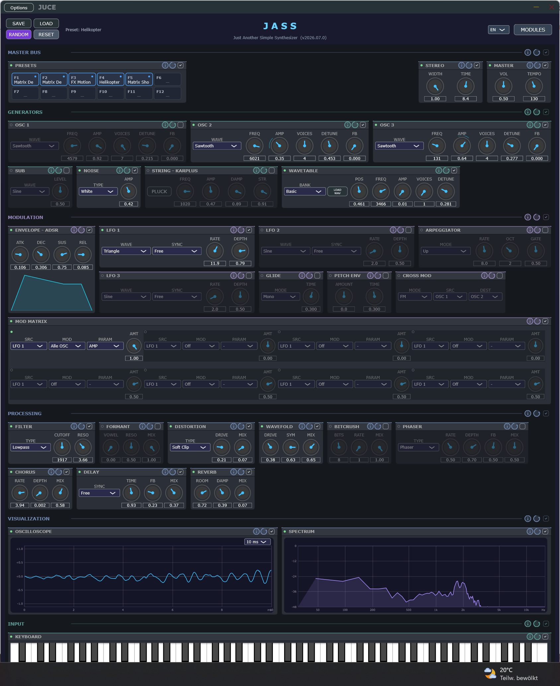
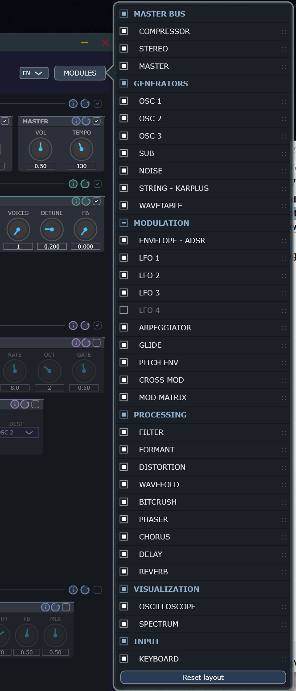

# JASS – Just Another Simple Synthesizer

A polyphonic software synthesizer written in **C++20 / [JUCE 9](https://juce.com/)**,
with an interface styled as a **19″ rack**. It runs as a **standalone** app, which
is the main focus.

### ⬇ Download

**[Get the latest release](https://github.com/mchwalt/JASS/releases/latest)** —
Windows & Linux builds (Standalone + VST3), produced automatically on every merge to
`main` by the CI pipeline.

> **VST3:** a VST3 build is produced as well, but it has so far only been tested
> **very superficially in vPlayer 4 Lite** — treat plugin support as experimental.

## Why this project

JASS is about building a **simple synthesizer with an intuitive interface** — one
where you get **quick first wins with good-sounding results** instead of getting
lost in menus. The goal is a **playful way into synthesis and sound processing**:
tweak a few knobs, hear something musical right away, and from there explore how
the pieces fit together — and invent your own solutions and signal paths, also
**off the beaten track**, beyond the usual textbook layouts.

Everything you need is on one screen: sources, modulation, and processing laid
out as a rack you can rearrange, with per-module and per-zone **enable / reset /
info** so nothing is hidden and every control explains itself.



## Features

**Sound sources**
- **3 oscillators** — sine / sawtooth / square / triangle, each with enable,
  freq, amp, **per-oscillator unison** (1–7 voices, detune) and **self-FM** (feedback)
- **Cross-mod / mix modes** — additive, ring modulation, FM between selectable
  sources (SRC/DEST)
- **Sub oscillator** — sine/square, −1/−2 octave, tracks OSC 1 pitch
- **Wavetable oscillator** — 6 built-in banks (Basic, Digital, Harmonic, Vocal,
  PWM, Spectral) with example WAVs, position morph, **WAV import**, own unison
- **Noise** — white / pink / brown / blue
- **Karplus-Strong** — plucked string, played from the keyboard
- **SAMPLER** — play your own recordings (WAV/AIFF/FLAC, ≤60 s) as a sound source
  through the whole chain: ROOT-key tape-style transposition, START/END, One-Shot /
  Loop (crossfaded, beat-locked via a shared loop clock) / Reverse modes, SPEED
  (0.25×–4×), stereo files rendered as two placed sub-sources. **Multisampling**:
  load a folder of `Name_C3.wav`-style files (or a basic `.sfz`) as one set — zones
  spread across the keyboard with their own roots, and `.sfz` **velocity layers**
  respond to your touch (soft hit → soft recording). **STRETCH**: pitch/time
  decoupling — the key sets only the pitch, SPEED only the tempo, loops stay
  beat-locked on every key (Signalsmith Stretch, MIT). Ships with an example
  catalog (seeded to `%AppData%\JASS\Samples`); presets reference sets by name.
  - 🎹 **Two multisampled grand pianos included as free downloads** — AKAI's
    **Splendid** Steinway and Alexander Holm's **Salamander** Yamaha C5, four
    velocity layers each. Unzip, pick the set, play:
    **[Optional piano multisample sets](#optional-piano-multisample-sets)**.
    Sets load in the background, so a library of this size no longer delays
    the start of the app — a patch's own instrument is fetched first and
    selected as soon as it is ready.

**Input devices**
- **On-screen keyboard** — playable with mouse & computer keys
- **MIDI keyboard / controller** — the synth accepts MIDI note input with velocity
  (a mod-matrix source): in the standalone pick the device in the audio/MIDI
  settings; as a VST3 it receives MIDI from the DAW track

**Envelopes & modulation**
- **ADSR** + **pitch envelope**
- **4 LFOs** (sine/triangle/square/saw), tempo sync
- **Modulation matrix** — **8 slots**, two-step **MODULE → PARAM** routing: pick a
  module, then any of its parameters (sorted A→Z, named exactly like the knobs).
  **Per-oscillator** targets (route FREQ/AMP/DETUNE/FB/VOICES to a *single* OSC, or
  "Alle OSC" for all), plus near-**full coverage** of every module's continuous
  parameters. Sources: LFO 1–4 / envelope / velocity. Each routing has a bipolar
  amount, auto-enables its source + target module, and shows a live modulation ring.
- **Poly glide** (mono/legato/poly), **arpeggiator** (up/down/up-down/random)
- **STEP SEQ** — a 32-step sequencer (two rows of sixteen) that plays a figure you
  write, transposed by the key you hold. Per-step semitone offset and an on/off
  switch (off = rest); one global GATE for note length, 1.0 holding each note into
  the next step. Locked to the tempo like the LFOs and DELAY, or free-running. It
  replaces the ARPEGGIATOR — both take over the held chord, so only one can run.
  Point it at a drum map and the offsets pick the *instrument* instead of a pitch.

**Processing & effects**
- **Biquad filter** (lowpass/highpass, resonance) + **formant filter**
- **Distortion** (soft/hard clip, foldback), **wavefolding**, **bitcrusher**
- **Compressor**, **phaser/flanger**
- **Delay** (tempo sync), **chorus**, **reverb**
- **STEREO output stage** with a per-generator **PAN** and five modes: Mono,
  **Pseudo-stereo** (Haas widener, on by default), **Stereo-Pan**, **Binaural**
  (parametric headphone 3-D) and **Kunstkopf (HRTF)** — real out-of-head placement
  by convolving each generator with a measured **MIT KEMAR** head impulse response.
  PAN is a mod-matrix target, so any source can auto-pan a voice in 3-D.
- **Kunstkopf externalization (ROOM)** — a binaural **early-reflection** stage
  (six non-harmonic taps, 8–24 ms, rendered through lateral KEMAR ears) that pushes
  the headphone image **out of the head** — the cue dry HRTF rendering cannot
  deliver. Level-neutral at any setting; heard best on transients (plucks, arps).

**Playing & workflow**
- **19″ rack UI** with zones; every module and zone has **enable / reset / info**
  (context help, EN/DE)
- Show/hide and reorder modules (persisted), **randomize** & **reset**
- **Stereo oscilloscope + spectrum analyzer** (FFT) — tapped at the **final output**
  (after all master stages incl. the spatial modes), L/R side-by-side scope plots and a
  two-colour spectrum, with automatic mono collapse and per-channel scope triggering
- **3D spinning JASS logo** in the header (toggle off via right-click)
- **Presets** in the `.jass` format + an auto-saved live state; demo presets
  (incl. **"Matrix Showcase"**, which exercises the whole mod matrix) and example
  wavetables ship embedded and seed on first run
- **`DAF Bass`** (F9) and **`Drum Pattern`** (F10) demo the STEP SEQ: a bass figure
  measured off a 1981 record, and a drum pattern with real gaps driving the SAMPLER.
- **PRESETS quick-access bank** (F1–F12) in the MASTER BUS — single-press loads,
  double-press assigns; assignments are global. **F8 = GrandPiano**: the
  Splendid set with nothing else in the signal path, for when you just want a
  piano

Use the **MODULES** button to show/hide modules per zone, reorder them by drag &
drop, and set each module's **left/right alignment** within its zone row via the
**L/R tags** (e.g. keep MASTER BUS modules hugging the right). The whole layout —
visibility, order and alignment — is saved; "Reset layout" restores the factory
arrangement:



## Build & run

**Prerequisites:** Visual Studio 2022 (C++ Desktop workload), CMake, Git.
JUCE is a **Git submodule** (only the commit pointer lives in this repo).

**CPU:** builds target **AVX** (`/arch:AVX`, `-mavx`), so a processor older than
Sandy Bridge / Bulldozer (both 2011) will not run JASS. That is deliberate: the
DSP is measurably ~3× faster than the SSE2 default, and AVX2 was measured to add
nothing on top, so the lower of the two equally fast baselines was chosen.

```powershell
# 1. Clone with the JUCE submodule
git clone --recurse-submodules <repo-url> JASS
cd JASS
#   (if already cloned without --recurse-submodules:)
git submodule update --init --recursive

# 2. Configure (generates build/ via CMake)
cmake -B build -G "Visual Studio 17 2022"

# 3. Build the standalone (Release)
& 'C:\Program Files\Microsoft Visual Studio\2022\Community\MSBuild\Current\Bin\MSBuild.exe' `
    build\JASS_Standalone.vcxproj /p:Configuration=Release /m
```

**Output:**
- Standalone: `build\JASS_artefacts\Release\Standalone\JASS.exe`
- VST3: `build\JASS_artefacts\Release\VST3\JASS.vst3` (target `JASS_VST3.vcxproj`)

> Note: MSBuild slash arguments (`/m`) get mangled in Git Bash — run the build
> from **PowerShell**.

## Project layout

```
Source/
├─ PluginProcessor.*      Audio processor, APVTS, live state, app-data setup
├─ Modules/               Declarative module specs (one module = one place):
│                         <Name>Specs.h generate APVTS params + rack descriptor
├─ Audio/
│  ├─ Parameters.h        parameter IDs + applyToVoice()
│  ├─ PresetIO.h          .jass import/export (nested v6, migration)
│  └─ SynthVoice.*        one voice (oscillators, generators, effects)
├─ DSP/                   Oscillator, Noise, KarplusStrong, WavetableBank,
│                         BiquadFilter, LFO, ADSR, Effects, ModMatrix …
└─ UI/                    rack editor + knob/display components
```

Architecture details: **[`docs/ARCHITECTURE.md`](docs/ARCHITECTURE.md)** ·
module-spec system: **[`docs/MODULE_SYSTEM.md`](docs/MODULE_SYSTEM.md)**.

## Docs

**For developers:**

- **[`docs/ARCHITECTURE.md`](docs/ARCHITECTURE.md)** — system architecture: layers,
  audio signal flow, threading & RT-safety, state/persistence, UI architecture
- **[`docs/MODULE_SYSTEM.md`](docs/MODULE_SYSTEM.md)** — the declarative module-spec
  system ("one module = one place") + recipes for adding parameters & modules
- **[`docs/DEVELOPER_GUIDE.md`](docs/DEVELOPER_GUIDE.md)** — build, dependencies,
  versioning/CI, all configuration surfaces, compile-time tunables, build gotchas

**Reference:**

- **[`docs/JASS_Preset_Format.md`](docs/JASS_Preset_Format.md)** — `.jass` preset format (nested v6)
- **[`docs/Glossary.md`](docs/Glossary.md)** — glossary
- `docs/notes/` — internal ideas, research & cheat-sheet notes (not official docs)

## Versioning

JASS uses **CalVer** — `YYYY.MM.MICRO` (e.g. `2026.07.0`) — shown in the header
subtitle and the right-click title info menu. Changes land on `main` only via pull
requests, and each merge bumps the version. See **[`CHANGELOG.md`](CHANGELOG.md)**.

The app version is independent of the preset **`FormatVersion`** (an integer schema
contract — see [`docs/JASS_Preset_Format.md`](docs/JASS_Preset_Format.md)).

**Releases / CI.** A GitHub Actions pipeline (`.github/workflows/release.yml`) runs on
every merge to `main`: it derives the next CalVer, builds Windows + Linux artifacts
(Standalone + VST3), and publishes them to a GitHub release (see the Download link above).

**Contributing.** Don't push to `main` directly — use a feature branch + PR. Enable the
local guard hook once per clone:

```sh
git config core.hooksPath .githooks
```

## License

JASS is released under the **[GNU GPL v3](LICENSE)**.

JASS embeds **JUCE** as a submodule. JUCE is dual-licensed (**GPLv3 or a
commercial JUCE licence**); the GPLv3 choice covers free JUCE use. Distributing
JASS under other terms requires an appropriate JUCE licence.

### Third-party data & code

The **Kunstkopf (HRTF)** output mode uses the **MIT KEMAR** HRTF measurements
(Bill Gardner & Keith Martin, MIT Media Lab, 1994), embedded as
[`Source/DSP/KemarHrir.h`](Source/DSP/KemarHrir.h). The data is provided free with
no restrictions on use, provided the authors are cited — see
<https://sound.media.mit.edu/resources/KEMAR.html>. The embedded header is
regenerated from the original set by [`tools/gen_kemar_hrir.py`](tools/gen_kemar_hrir.py)
(see [`tools/README.md`](tools/README.md)).

The SAMPLER's **STRETCH** mode (pitch/time decoupling) uses **Signalsmith Stretch**
by Geraint Luff / Signalsmith Audio Ltd. (MIT license), vendored under
[`Source/ThirdParty/signalsmith-stretch/`](Source/ThirdParty/signalsmith-stretch/)
together with its `signalsmith-linear` FFT dependency — see
<https://github.com/Signalsmith-Audio/signalsmith-stretch> and the license files
in that folder.

### Optional piano multisample sets

Two real grand pianos play beautifully through the SAMPLER. They are not part
of the repository (≈65 MB of samples don't belong in git history) — download
them as ready-made zips from the
[**piano-pack-v2 release**](https://github.com/mchwalt/JASS/releases/tag/piano-pack-v2)
and unzip into `%AppData%\JASS\Samples\`:

- **JASS-SplendidPiano.zip** — AKAI's Steinway recordings (samples Public
  Domain), four velocity layers (PP/MP/MF/FF), 242 regions. Ships a
  `NOTICE.txt` crediting the upstream SFZ mapping at
  [sfzinstruments/SplendidGrandPiano](https://github.com/sfzinstruments/SplendidGrandPiano).
- **JASS-SalamanderPiano.zip** — Alexander Holm's Yamaha C5
  ([sfzinstruments/SalamanderGrandPiano](https://github.com/sfzinstruments/SalamanderGrandPiano),
  **CC BY 3.0**), four velocity layers (v4/v8/v12/v16) with the natural
  stretch tuning; `ATTRIBUTION.txt` inside carries the license details and
  the change list. (Builds without velocity layers use
  [piano-pack-v1](https://github.com/mchwalt/JASS/releases/tag/piano-pack-v1).)

Picking either set in the SAMPLER auto-configures the module as an instrument
(One-Shot, no STRETCH, its own release; ENVELOPE off and Stereo-Pan output when
the sampler is the sole generator).

Both zips are reproducible from source: `python tools/build_piano_zips.py`
fetches the upstream repos (shallow) and assembles them around the curated
`.sfz` files in [`tools/piano-packs/`](tools/piano-packs/). A third option,
the **Iowa Steinway**, still builds with `python tools/get_iowa_piano.py`
(University of Iowa [MIS](https://theremin.music.uiowa.edu/MIS.html)
recordings, freely available without restrictions).

### Optional drum kit

The `Drum Pattern` demo (F10) drives a drum map from the STEP SEQ: the step
offsets pick the instrument, not a pitch. It expects
[**SamsSonor**](https://github.com/sfzinstruments/SamsSonor) — Sam Greene's kit,
mapped to SFZ by kinwie, **CC BY-SA 4.0**, ~35 MB. Nothing is redistributed here:
download the repository yourself and drop it into `%AppData%\JASS\Samples\` as
its own folder, so that `SamsSonor.sfz` sits next to its `Samples/` directory.
JASS loads it straight from the upstream `.sfz` — no curated copy in between.

One thing the kit does that JASS does not yet: **choke groups**. On a real kit a
closed hi-hat silences the ringing open one (`group=` / `off_by=` in SFZ). JASS
ignores those opcodes, so the two hats sound over each other.
