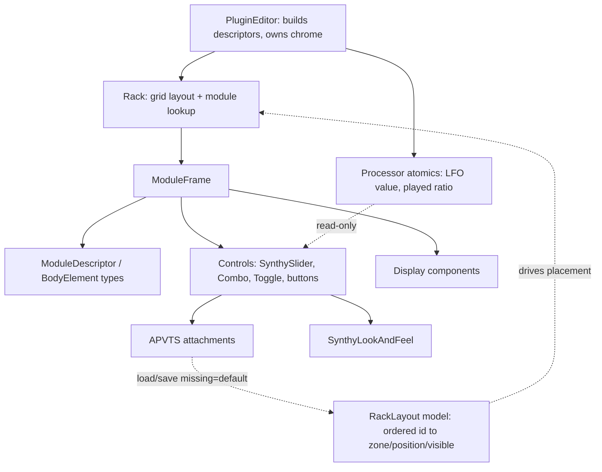

# Architecture Spine — JASS Editor Unified Rack UI

## Design Paradigm

**Declarative, data-driven component composition.** A module is *data* (a `ModuleDescriptor`), not a bespoke component. One generic `ModuleFrame` renders any descriptor; one `Rack` owns all placement. This replaces the three legacy build mechanics (`OscillatorPanel`, reused `EffectPanel`, hand-laid inline modules) that caused the "cobbled-together" look.

Layer → location:

| Layer | Lives in |
| --- | --- |
| Framework (frame, rack/grid, descriptor + control types, LookAndFeel) | `Source/UI/rack/` |
| Reusable display components | `Source/UI/` (`WaveformDisplay`, `SpectrumDisplay`, `EnvelopeDisplay`) |
| Standard knob | `Source/UI/SynthySlider.h` |
| Descriptor assembly + global chrome + rack ownership | `Source/UI/PluginEditor.*` |

## Invariants & Rules

### AD-1 — One generic ModuleFrame + declarative descriptor `[ADOPTED]`
- **Binds:** all editor modules (FR1–FR3).
- **Prevents:** per-module bespoke layout code — the divergence that produced the inconsistent UI.
- **Rule:** every module is expressed as a `ModuleDescriptor` rendered by the single `ModuleFrame`. No module subclass carries its own layout. Adding/editing a module is a data change, not a new component.

### AD-2 — The Rack owns all placement on a fixed 12-column grid `[ADOPTED]`
- **Binds:** rack + every module (FR8–FR10, NFR1).
- **Prevents:** modules choosing incompatible sizes/positions; scattered `resized()` math; layout coupled to knob diameter.
- **Rule:** layout is a fixed **12-column proportional grid** × rack-units (unit height `Hu`, uniform gutters) — a pure raster **decoupled from knob size**. A module declares **only** its size class, which is a **column span**: **XS = 2×1, S = 3×1, M = 4×1, L = 4×2, XL = 6×2** (cols × units). A module occupies whole grid multiples. All `resized()` geometry lives solely in the rack layout engine; no module computes its own bounds. The unit height is **compact** = header + one knob row, so XS/S/M span 1 unit and L/XL span 2 (a 1:2 height ratio).
- **`ModuleFrame` body derives its internal column count from CONTENT**, not from the size class or knob diameter: `nCols = ceil(contentSlots / units)`, knobs centred, body filling the module width. (This replaced the earlier `cols×3` scheme that coupled layout to the knob diameter.)
- **The size-class set is a single data-driven table** `class → { cols, units, slotCapacity, knobSize }`; today `{ XS, S, M, L, XL }`. A new class is added by appending **one table row** — never by per-module custom dimensions; a module always picks an existing class.
- **`slotCapacity` is now a generous debug guard, not the layout driver.** The frame still `jassert`s `usedSlots(body) ≤ slotCapacity(sizeClass)` at construction to catch a wildly over-stuffed descriptor, but layout flows from content (`nCols` above), not from a fixed per-class slot count. A module that genuinely needs more room picks a larger class (e.g. Wavetable → L, scope/spectrum → XL).

### AD-3 — Single uniform knob size (provisional)
- **Binds:** all knobs across all size classes (FR2).
- **Prevents:** inconsistent control sizing between modules.
- **Rule:** one knob diameter for every module regardless of size class. **Revisit:** if large modules read as empty/unimportant, switch to per-size-class knob sizes (S→Small, M→Medium, L→Medium/Large).
- **Note (AD-2 12-col decoupling):** since the grid raster is now independent of knob diameter (AD-2), per-size knob sizes would be a purely **cosmetic** choice — they no longer drive layout, lowering the risk this revisit ever needs to fire.

### AD-4 — Fixed module descriptor + control vocabulary `[ADOPTED]`
- **Binds:** all modules (FR3, FR4).
- **Prevents:** ad-hoc control wiring; controls that exist in code but have no declarative form.
- **Rule:** `ModuleDescriptor = { sizeClass, title, typeTag(Generator|Modulator|Processor), enableParam?, resetParams[], body[] }`. `body` is an ordered list of `BodyElement`, each one of: `Knob{paramId,label,displayTransform?,modTarget?}`, `Combo{paramId,label,items:static|dynamicProvider}`, `Toggle{paramId,label}`, `Action{label,onClick,refreshes?}`, `FileAction{label,onChoose,refreshes?}`, `Caption` (static-text element with a `text` field; named to avoid the `juce::Label` clash), `Display{component,slots}`. The frame renders a uniform header (title + optional enable + reset ↺) and flows `body` into grid slots. A missing `enableParam` means the module is always-on (Master, ADSR, Mix-Mode) — header geometry stays identical, always lit.
- **`displayTransform` is a pair** `{ toDisplay(base, ratio), fromDisplay(shown, ratio) }` with a mandatory guard: when `ratio ≤ 0` (no note sounding) the transform is identity and write-back is suppressed — never divide a stale/zero ratio into the base param (protects FR4 FREQ display + NFR3 state integrity). The `ratio` arrives on the same read-only live-feed channel as modulation (AD-8).
- **Dynamic combos refresh declaratively:** an `Action`/`FileAction` may list `refreshes: [comboParamId]`; the frame re-polls those dynamic providers after the action fires (replaces the manual `refreshBankSelector()` for the Wavetable bank). No combo is refreshed by an external reference.
- **Reset writes only APVTS:** `resetParams[]` writes each param's default into APVTS; everything else (Displays, dynamic combos) reacts through its normal channel — no special reset path.

### AD-5 — Graphic displays are BodyElements `[ADOPTED]`
- **Binds:** scope, spectrum, ADSR-curve modules (FR11).
- **Prevents:** a separate custom-body path = a display special-case = the drift source.
- **Rule:** a display is a `Display{component, slots}` body element occupying grid slots through the *same* layout mechanism as controls. Scope/Spectrum = a module whose body is one `Display` spanning all slots; ADSR = knobs + one `Display`. Existing display components are reused as the wrapped `component`. When a module is disabled, the **whole body region dims uniformly, including any Display** (the display keeps its own poll/repaint; dimming is a frame-level overlay, not a per-component path).

### AD-6 — The frame owns parameter binding `[ADOPTED]`
- **Binds:** every parameter-bound control (FR4, NFR2/NFR3).
- **Prevents:** scattered, hand-wired attachments drifting from the descriptor.
- **Rule:** `ModuleFrame` creates and owns the APVTS attachment for each bound `BodyElement` from its `paramId`. The editor never declares per-control `*Attachment` members. Parameter IDs and the APVTS layout are untouched (inherited).

### AD-7 — One shared LookAndFeel; SynthySlider is the only knob `[ADOPTED]`
- **Binds:** all controls (FR2).
- **Prevents:** divergent control styling.
- **Rule:** a single `SynthyLookAndFeel` is set by the rack and applies to all modules. `SynthySlider` is the standard knob everywhere (rotary, right-click value entry, shift-fine drag, wheel-step, modulation ring). No module installs its own LookAndFeel.

### AD-8 — Modulation rings are declarative
- **Binds:** knobs that are LFO targets (FR4).
- **Prevents:** the editor holding fixed references to specific knobs (hand-wiring returning).
- **Rule:** a `Knob` may carry an optional `modTarget` (`Frequency|Amplitude|FilterCutoff`). The rack offers lookup "all knobs with `modTarget == X`". A single editor timer reads the processor's LFO atomic + active target and sets the matching knobs' rings. No knob ring is wired by direct reference.

### AD-9 — Cross-module coupling only through shared APVTS `[ADOPTED]`
- **Binds:** Mix-Mode and the three OSCs (FR13); any future inter-module dependency.
- **Prevents:** one module holding a reference to another (Mix-Mode reaching into OSC1/2/3) — a coupling the descriptor can't see.
- **Rule:** Mix-Mode is its own module (size **XS**: a `Combo` + a `Caption`). Its effect on how OSC 1/2/3 combine flows **only** through the shared `mixMode` APVTS param read by the audio engine — OSC descriptors carry no knowledge of it, and no module references another module. All cross-module state rides shared params.

### AD-10 — Ordered layout model is the single source of truth for placement (Epic 4)
- **Binds:** the rack and every Epic-4 feature — show/hide, move-between-zones, reorder-within-zone, persistence (FR15–FR20).
- **Prevents:** each feature keeping its own private view of order/visibility (today placement is *implicit*: a module's zone is passed to `Rack::addModule(zone, desc)` and within-zone order is raw insertion order, with no visibility concept) — the divergence that makes drag-drop, hide, and load fight each other.
- **Rule:** the rack renders from **one ordered data model** `RackLayout = [ { id, zone, position, visible } ]` keyed by the module's stable `id` (AD-4 descriptor id, shipped in Story 1.5). Show/hide, move, and reorder mutate **only this model**; the rack then re-runs the **single `layout()` packing path** (AD-2) to re-pack — no component computes its own bounds, so NFR1 still holds in the dynamic case. Each module declares its **default zone and default order on the `ModuleDescriptor`** (moved off the `addModule` call-site); the built-in default layout is reproducible from descriptors alone, and a customized layout is a **delta** against it. `typeTag` remains **identity/colour only** and never changes when a module moves (moving Reverb into GENERATORS keeps it a Processor — AD-9 spirit).
  - **Interaction mechanism (revised 2026-07-11):** the user drives show/hide + reorder + zone-move through a **reorderable customization list** (Story 4.2, opened from the MODULES button) where **list order = on-screen placement order** — *not* on-rack drag & drop. This is a UI realization of the same invariant (mutate the model → re-run `layout()`); it is simpler/more robust and unifies all three operations in one place.

### AD-11 — Layout persistence is append-only, interop-safe, default-on-missing (Epic 4)
- **Binds:** preset serialization (FR19, NFR6); extends the inherited NFR3 format-integrity constraint.
- **Prevents:** a format fork — a layout store that breaks `.synthy` round-trip with older builds or the C# app.
- **Rule:** the custom `RackLayout` serializes as **append-only standard APVTS parameters** in the existing `.synthy` preset. **No `kFormatVersion` bump; no existing ID renamed or reordered.** A preset lacking the layout params (older build, or the C# app) loads with the **built-in default layout** (missing ⇒ default), mirroring the `MasterOn/AdsrOn/MixModeOn` back-compat pattern. The C# app ignores the new params until it chooses to mirror them. **"Reset layout"** restores the descriptor defaults into the model and touches **no audio parameter**.

### AD-12 — Width fixed, height auto-fits the visible rack (Epic 4)
- **Binds:** the editor ↔ rack sizing boundary (NFR6; narrows PRD non-goal).
- **Prevents:** the editor and rack disagreeing on who owns height after modules are hidden/shown.
- **Rule:** window **width stays fixed** (1520 px). After any layout mutation the rack recomputes `preferredHeight(width)` from the **visible** modules and the editor re-applies `setSize` (the auto-fit-down transform still applies on small displays). This is **automatic**, not a user-drag or zoom — the "no user-resizable/zoomable editor" non-goal is narrowed to *width-fixed, height-auto*, DPI/zoom still deferred.

### Dependency direction



## Consistency Conventions

| Concern | Convention |
| --- | --- |
| Naming | Framework types `ModuleFrame`, `Rack`, `ModuleDescriptor`, `BodyElement`. One descriptor-builder per module (e.g. `makeOsc1Descriptor`). Existing `Synthy*` class-name prefix kept (inherited). |
| Data & formats | Parameter IDs come only from `Parameters::ID` (inherited, canonical); controls reference `paramId`, never literals. Size class is the only sizing input a module gives. |
| State & cross-cutting | APVTS is the single source of truth (inherited). UI→audio handoff via `std::atomic` only (inherited). Attachments owned by the frame. No allocation/locking on the audio thread (inherited). |

## Stack

| Name | Version |
| --- | --- |
| C++ | 20 (existing) |
| JUCE | vendored submodule (existing) |

_No new dependencies; this is a UI refactor on the current stack._

## Structural Seed

```text
Source/UI/
  rack/
    ModuleDescriptor.h    # descriptor + BodyElement variant types
    ModuleFrame.h/.cpp    # renders one descriptor: uniform header + body flow
    Rack.h/.cpp           # grid layout engine + zone headers + modTarget lookup + RackLayout model (Epic 4)
    SynthyLookAndFeel.*   # the single shared look (moved out of PluginEditor)
  SynthySlider.h          # standard knob (existing)
  WaveformDisplay.h       # reused as Display{component} (existing)
  SpectrumDisplay.h       # reused (existing)
  PluginEditor.h/.cpp     # builds descriptors, owns Rack + fixed chrome (preset header, keyboard)
```

Fixed chrome stays in `PluginEditor`, outside the rack grid (FR14): preset SAVE/LOAD/RANDOM/RESET, centred title, preset-name / "Current State" indicator (in the Save/Load cluster), and the on-screen keyboard. **Master volume + Stereo (width/time + enable) are rack module descriptors** in a dedicated **MASTER BUS** zone (top row of the rack, right-aligned), not header chrome — consistent with AD-1 ("every module from one mold"). `EnvelopeDisplay` moves into `rack/` or stays a display component — either is fine; it is consumed as a `Display`.

## Capability → Architecture Map

| PRD area | Lives in | Governed by |
| --- | --- | --- |
| Shared module framework (FR1–FR4) | `rack/ModuleFrame`, `rack/ModuleDescriptor` | AD-1, AD-4, AD-6 |
| Module anatomy & identity (FR5–FR7) | `ModuleFrame` header + typeTag + dimmed-body rule | AD-1, AD-4 |
| Standard sizes & rack layout (FR8–FR11) | `rack/Rack` | AD-2, AD-5 |
| Migration & header (FR12–FR14) | per-module descriptors in `PluginEditor`; chrome in `PluginEditor` | AD-1, AD-4 |
| Maintainability / RT / state (NFR1–NFR3) | rack engine; inherited constraints | AD-2, AD-6, conventions |
| Rack customization: show/hide, reorder, zone-move via a reorderable list (FR15–FR18, FR20) | `RackLayout` model + `Rack` (mutate model → re-run `layout()`); customization list panel in the editor; default zone/order on `ModuleDescriptor` | AD-10, AD-2 |
| Layout persistence + reset (FR19, NFR6) | `RackLayout` ↔ append-only `.synthy` params; editor height auto-fit | AD-11, AD-12 |

## Deferred

- **Exact grid constants** (`Wc`, `Hu`, column count, gutter, knob diameter) — pinned visually in the HTML rack mockup, then frozen as code constants.
- **Per-module size-class assignment** (which of the ~20 modules is S/M/L) — first pass in the mockup; finalized with epics/stories.
- **Per-size-class knob sizes** — only if AD-3's uniform-size attempt fails (its revisit condition).
- **Fourth size class (wide-display `W`)** — the class table (AD-2) is built to accept it; define the row when a module first needs >2-column display width. Not implemented now.
- **VST3 editor parity** — same editor should render in VST3; validate after standalone (NFR4), not a blocker.
- **DPI-scalable / zoomable rack** — still deferred. As of Epic 4 the window **height** auto-fits the visible modules (AD-12); **width stays fixed** and there is no user zoom/DPI scaling.
- **Module identity + mutable placement — ✅ REALIZED by Epic 4 (AD-10/11/12).** The former groundwork landed as planned: (1) stable module `id` shipped in Story 1.5; (2) explicit default zone + (3) ordered placement model are now **AD-10** (`RackLayout = id → { zone, position, visible }`), with persistence decided as append-only `.synthy` params (**AD-11**). The drag/show-hide interaction and reset are Epic 4's stories. `typeTag` stays identity/colour and never changes on move.
- **C# app layout mirror** — the C# Synthy ignores the new layout params (AD-11 back-compat); mirroring the customization UI/serialization is a separate follow-up (tracked in `deferred-work.md`), not part of this epic.
