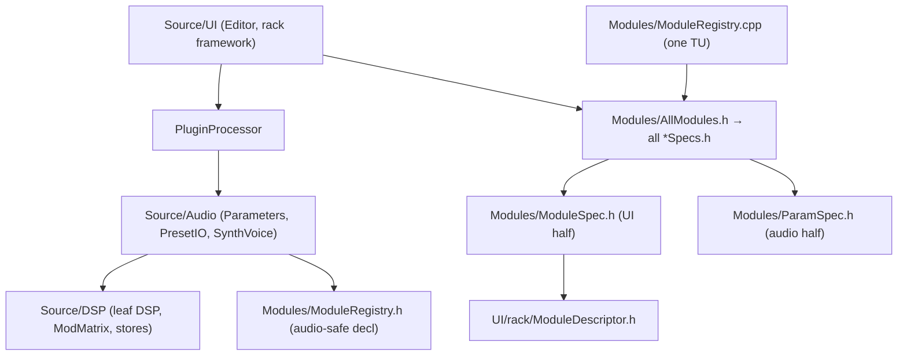

# JASS — Architecture

This document describes the system architecture of JASS: layers and dependency
rules, the audio signal flow, the threading / real-time-safety model, state &
persistence, and the UI architecture. It complements:

- [`MODULE_SYSTEM.md`](MODULE_SYSTEM.md) — the declarative module-spec system
  ("one module = one place") and the recipes for extending it
- [`DEVELOPER_GUIDE.md`](DEVELOPER_GUIDE.md) — build, dependencies, versioning,
  configuration surfaces, known gotchas
- [`JASS_Preset_Format.md`](JASS_Preset_Format.md) — the `.jass` preset format
- [`Glossary.md`](Glossary.md) — abbreviations & domain terms (APVTS, HRTF,
  CalVer, …); special terms below link to their glossary entries

The formal design record (architecture decisions **AD-1…AD-12**, PRD, epics,
per-story implementation notes) lives in `_bmad-output/` — see
[§9](#9-design-decision-record).

> Conventions in this doc: code references name **files and symbols**, not line
> numbers. All paths are relative to the repo root.

---

## 1. Overview

JASS is a polyphonic software synthesizer written in **C++20** on
**[JUCE 9](Glossary.md#juce)** (vendored as a Git
[submodule](Glossary.md#submodule)). It builds as a
**[Standalone](Glossary.md#standalone)** app (primary target) and a
**[VST3](Glossary.md#vst3)** plugin (experimental) from a single CMake project.

Key characteristics:

- **8 [voices](Glossary.md#voice)**, each carrying its own complete generator + effect chain
  (instantiated per output channel — see [§4](#4-audio-signal-flow)).
- **Declarative module system**: a synth module (FILTER, LFO, SAMPLER, …) is
  declared once in a spec header; APVTS parameters, the rack UI descriptor and
  the nested preset persistence are all *generated* from that spec.
- **19″-rack UI**: one generic `ModuleFrame` renders every module from data
  (`ModuleDescriptor`); a grid engine (`Rack`) owns all placement.
- **`juce::AudioProcessorValueTreeState` ([APVTS](Glossary.md#apvts)) is the
  single source of truth** for all parameter state. Cross-module coupling
  happens only through APVTS ([AD](Glossary.md#ad)-9) — no module holds a
  reference to another.
- **[Append-only](Glossary.md#append-only) compatibility contract**: parameter IDs, choice orders, enum
  indices and preset fields are never renamed, reordered or removed. New things
  are appended; missing fields load as factory defaults.

---

## 2. Layer model

```
Source/
├─ PluginProcessor.{h,cpp}   Plugin core: SynthyProcessor (AudioProcessor, Timer,
│                            ValueTree::Listener, APVTS::Listener, MidiKeyboardState::Listener)
├─ Audio/
│  ├─ Parameters.h           Param ID namespace + createLayout() + applyToVoice()
│  ├─ PresetIO.h             .jass persistence, AppData folders, seeding, migrations
│  ├─ SynthVoice.{h,cpp}     One voice: generators + per-channel effect chain
│  └─ SynthSound.{h,cpp}     Trivial SynthesiserSound (applies to all notes/channels)
├─ DSP/                      Leaf DSP classes (mostly header-only), ModMatrix,
│                            ModTargets/ModMatrixCatalog, spatial panners, stores
├─ Modules/                  Declarative module specs (see MODULE_SYSTEM.md)
└─ UI/                       Editor, displays, help system
   └─ rack/                  Generic rack framework: Rack, ModuleFrame,
                             ModuleDescriptor, SynthyLookAndFeel, IconButton
```

### 2.1 Dependency direction



Dependencies point **downward only**: UI → core → audio → DSP, never back up.
The rules that keep this true:

- **`Modules/ParamSpec.h` is the audio-safe half** of the spec model — it has
  no UI includes, so `Parameters.h` stays UI-free.
- **`Modules/ModuleSpec.h` is the UI half** — the only spec header that pulls
  in `UI/rack/ModuleDescriptor.h`.
- **`Modules/ModuleRegistry.h`** exposes audio-safe declarations only
  (`appendAllParameters`, `writeState`, `readState`). Its definition in
  `ModuleRegistry.cpp` is the *single* translation unit that includes
  `AllModules.h` (and therefore the UI headers). `Parameters.h` and
  `PresetIO.h` include only the registry header.
- **`DSP/ModTargets.h`** and **`DSP/ModMatrixCatalog.h`** are deliberately
  dependency-free (no JUCE) so the audio, UI and persistence layers can share
  one target vocabulary. `rack::ModTarget` is a type alias for `LFOTarget`.
- `PluginProcessor.h` includes Audio/ + DSP/ only; the editor include lives in
  `PluginProcessor.cpp`.

### 2.2 What is generated vs. hand-written

| Generated from module specs | Hand-written |
|---|---|
| APVTS parameter layout (`createLayout()` is one call: `Modules::appendAllParameters`) | DSP `process()` of every module (`Source/DSP/`) |
| Rack UI descriptors (`makeModuleDescriptor`) | Param → DSP wiring (`Parameters::applyToVoice`) |
| Nested `.jass` persistence (`Modules::writeState/readState`) | ~9 modules with editor-bound UI bodies (see MODULE_SYSTEM.md §6) |

---

## 3. Threading & real-time-safety model

Two threads matter: the **[audio thread](Glossary.md#audio-thread)** (all of
[`processBlock`](Glossary.md#processblock) and everything it calls, including
`applyToVoice` and `SynthVoice::renderNextBlock`) and the **message thread**
(UI, timers, preset load/save). Rules, all enforced in code
([RT-safety](Glossary.md#rt)):

### 3.1 No allocation / locking / logging on the audio thread

- **Parameter reads** use cached raw atomics — `*apvts.getRawParameterValue(id)`.
- **Indexed parameter IDs** (`oscOn(i)`, `lfoRate(i)`, `modSlotSource(n)`, …)
  would each construct a `juce::String` per call (~550 heap allocations per
  block before the fix). The `JASS_INDEXED_ID` macro in `Parameters.h` replaces
  them with references into `static std::array<juce::String, N>` caches;
  `warmIndexedIds()` (called from `prepareToPlay`) pre-builds every cache on
  the message thread so no static-init guard lock can fire on the audio thread.
- **MIDI/scratch buffers are members**, pre-sized in `prepareToPlay`
  (`arpKeptScratch`, `glideRebuiltScratch`, glide note vectors with
  `reserve(128)`), and reused every block.
- **All channel strips of every voice are prepared up-front** in
  `SynthVoice::prepareToPlay`, so switching to a stereo output mode later never
  allocates.
- **Store contract (never-free)**: `WavetableBankStore` (`MaxBanks = 64`) and
  `SampleBankStore` (`MaxSets = 32`) are append-only slot arrays with an
  atomic `count` (release/acquire). A voice caches a raw
  `WavetableBank*`/`SampleSet*` (and since Story 12.2 a `SampleZone*` picked at
  note-on) for a whole render block or longer, so entries are **never freed** —
  "reset" merely lowers `count` (deferred reclamation). The sample store is
  bounded by three caps (60 s per file, 3600 s per set, 4 GiB global byte
  budget — raised in Story 12.5 for velocity-layered pianos), so never-free
  stays a bounded policy, not a leak.
- **Sample loading is off the message thread** (Story 12.6): a background
  thread in the processor scans the Samples folder, and a preset asks for the
  set it needs by NAME through `PresetIO::requestSamplerSet` instead of
  decoding it inline — the loader pulls that set to the front of its queue and
  selects it when it lands. `SampleBankStore::writerLock` serialises only
  `append()`, **never a decode**: holding it across a set would block the
  message thread for as long as a grand piano takes to decode. The audio
  thread's read path is untouched (`count`/`sets` via release/acquire).
  `pendingSamplerSetName` keeps the 1.5 s LiveState autosave from persisting
  the name behind an index that has not been resolved yet.
- Spatial DSP (`HrtfPanner`, `BinauralRoom`) is fully static-sized.

### 3.2 `parameterChanged` deferral

APVTS calls `AudioProcessorValueTreeState::Listener::parameterChanged`
*synchronously on the changing thread* — under host automation that is the
audio thread. `SynthyProcessor::parameterChanged` therefore does **no work**
off the message thread: it only sets atomic dirty flags
(`matrixEnablesDirty`, `crossModDirty`, `pendingCrossModCode` — the latter
encodes the parameter as a small int precisely to avoid constructing a
`juce::String`). The editor's 30 Hz timer drains them via
`reconcileParamCouplingsIfDirty()`, which runs the auto-enable couplings
([§5.4](#54-auto-enable-coupling)) on the message thread.

### 3.3 UI ↔ audio handoff (atomics inventory)

| Atomic | Purpose |
|---|---|
| `WaveformCapture::writePos` | scope ring index; audio writes release, GUI reads acquire |
| `lfoDisplayValues[kNumLFOs]` | last uiLFO values → mod rings + global mod path |
| `currentNoteRatio`, `heldNotesLo/Hi` | played-note ratio for the FREQ knob display |
| `pluckRequested` | PLUCK button → `exchange(false)` on the audio thread |
| `autoPlayEnabled`, `liveDirty`, `fixingMixSrc`, `matrixEnablesDirty`, `crossModDirty`, `pendingCrossModCode` | flags described above |

### 3.4 Timers

| Timer | Rate | Job |
|---|---|---|
| `SynthyProcessor` (Standalone only) | 1.5 s debounce | LiveState auto-save when `liveDirty` |
| `SynthyEditor` | 30 Hz | mod rings, FREQ displays, zone-header sync, coupling drain, F-key poll, keyboard enable gate |
| `ModuleFrame` | 20 Hz (only if the module has dynamic state) | dim state, conditional knobs, combo dependencies, slot LEDs |
| Displays (`WaveformDisplay`, `SpectrumDisplay`, `SpinningTitle3D`) | 30 Hz | repaint |
| `EnvelopeDisplay` | 20 Hz | ADSR curve |

### 3.5 Keyboard focus model

The on-screen keyboard is the **only** focusable component: after `buildRack()`
a recursive walk clears `wantsKeyboardFocus` on every other child, and the
editor itself refuses focus. Computer-key playing therefore works regardless of
which control was clicked last. Global shortcuts must not rely on focus:
they are event-driven via `keyStateChanged`/bubbling (F1–F12 preset bank,
arrow-key octave switch, Space = PLUCK), with a polled physical-key fallback
for the F-keys while a modal call-out or combo popup owns the focus (guarded by
`juce::Process::isForegroundProcess()`).

---

## 4. Audio signal flow

### 4.1 Voice management

- `SynthyProcessor` owns a `juce::Synthesiser` with **8 × `SynthVoice`** and one
  `SynthSound` (applies to all notes/channels).
- **Pitch model**: all FREQ knobs describe the sound at **C4 (MIDI 60)**; the
  played note transposes every generator via
  `transposeRatio = f(note)/f(60)`.
- **[Auto-play drone](Glossary.md#drone)**: while any generator is enabled and no key is held, a
  drone note (C4) plays on **MIDI channel 16** (`kDroneChannel`) so it never
  collides with played notes (channel 1). The first real key press silences it;
  a rising generator-enable edge re-arms it. The drone deliberately does not
  pluck the Karplus string.
- The **[arpeggiator](Glossary.md#arp)** works by *MIDI rewriting* in `processBlock`: raw channel-1
  note on/offs are filtered out of the block's MIDI buffer and replaced by the
  arp's sample-accurate step sequence (the drone on channel 16 passes through).
- **[Glide](Glossary.md#glide)** runs on the **final** MIDI buffer (after the arp) so it also glides
  arp steps. Poly mode maps new chord notes onto the previous chord
  position-wise (pitch-sorted); Mono/Legato mode rebuilds the buffer with
  explicit note-offs for the previously sounding note. Voices consume the
  shared `GlideInfo` in `startNote` via a multiplicative `SmoothedValue`.
- **[ADSR](Glossary.md#adsr)-off behaviour**: when the ADSR module is disabled, a 10 ms
  `SmoothedValue` gate (`bypassGate`) replaces the envelope both as gain and as
  the voice-free trigger — no clicks, no stuck voices.

### 4.2 Per-voice rendering (`SynthVoice::renderNextBlock`)

Per block: capture the "base" value of every modulatable parameter, derive the
active mod-slot masks, compute the channel count and per-generator pan gains,
and (in Kunstkopf mode) select each generator's HRIR kernel **once per block**
(refreshed every 64 samples only while PAN is actively modulated).

Per sample:

1. Advance glide, all LFOs (each exactly once), the ADSR (once — reused as
   both gain and mod source; the envelope *source* is zero when the ADSR
   module is off), and the bypass gate.
2. `modMatrixAccumulate(...)` — sum all active slots into a per-target offset
   array plus per-OSC offsets. Pure accumulation; curves/clamps are applied
   per target afterwards.
3. **Pitch**: global `Frequency` offset (octaves) + per-OSC pitch offsets,
   clamped to ±4 octaves (`kMaxPitchOct`); the pitch envelope multiplies
   osc + wavetable + sub (not Karplus — its string length is fixed at pluck
   time).
4. Apply generator-target mods (wavetable pos/amp/…, sub/noise/sampler level,
   Karplus amp/damp/stretch, per-OSC detune/feedback/voices/amp).
5. **Mix the generators into the per-channel bus via equal-power panning**
   (`addPanned`), in this order: [cross-mod](Glossary.md#crossmod) branch
   (FM: OSC A modulates OSC B's phase, only the carrier is emitted; RingMod:
   `a·b·2`; otherwise all three OSCs additive) → noise →
   [Karplus](Glossary.md#karplus) → [wavetable](Glossary.md#wavetable) → sub →
   [sampler](Glossary.md#sampler) (stereo sample sets render as two placed
   sub-sources `PanSamplerL/R`; a multisample set's zone — key range + own
   root — is picked per voice at note-on, Story 12.2; the optional STRETCH
   mode decouples pitch from time via a per-voice vendored Signalsmith
   Stretch instance — configured in `prepareToPlay`, allocation-free in
   `process` — Story 12.3).
6. Global amplitude tremolo, then the envelope/gate gain.
7. **Per-channel effect chain** — each output channel owns a full
   `ChannelStrip`, so a left-panned generator also reverberates left:

   ```
   applyFxMods → wavefolder → ×ampGain → filter → formant → ×envGain
   → distortion → bitcrusher → phaser → chorus → delay → reverb → clamp(±1)
   ```

**[`DSP/ChannelStrip.h`](Glossary.md#channelstrip)** is the channel-agnostic voice bus:
`kMaxOutChannels = 2` (a later surround phase raises it),
`kNumPanGenerators = 9` (OSC 1–3, SUB, NOISE, KARPLUS, WAVETABLE, SAMPLER L/R),
`positionToGains()` returns 1.0 for mono (byte-identical legacy path) or
equal-power cos/sin for stereo. The voice's legacy single-channel FX members
are reference aliases onto `strips[0]`, so all pre-stereo code paths still
compile against channel 0. Delay and reverb are **per voice**, not bus sends.

### 4.3 Bus processing (`SynthyProcessor::processBlock`)

Stage order after the housekeeping (auto-play/drone, tempo resolve from host
BPM or the MASTER TEMPO knob, arp MIDI rewrite, glide):

1. `synth.renderNextBlock(...)` — all voices mix into the buffer.
2. Advance the four display-only `uiLfos` → `lfoDisplayValues[]` (these feed
   both the mod rings and the global mod path — "ring == audio").
3. **Compressor** (feed-forward, stereo-linked peak detector) on the summed mix.
4. **StereoWidth** (Lauridsen complementary comb, mono-compatible) — only in
   **Pseudo-Stereo** mode.
5. **BinauralRoom** (ROOM early reflections) — only in **Kunstkopf** mode,
   reset on mode entry.
6. **Master volume** via `applyGainRamp` (zipper-free under modulation).
7. **WaveformCapture tap — the very last stage**: the oscilloscope and
   spectrum show the true final output, after everything including master
   volume.

### 4.4 Spatialization (STEREO output stage)

[`OutputMode`](Glossary.md#outputmode) (must match the STEREO module's choice
order): `Mono = 0`, `PseudoStereo = 1` *(default)*, `StereoPan = 2`,
`Binaural = 3`, `Kunstkopf = 4`.

- **Mono / [Pseudo-Stereo](Glossary.md#pseudo-stereo)** reproduce the historic
  engine byte-identically (voices render one channel; the Haas widener runs on
  the bus).
- **Stereo-Pan**: true amplitude panning per generator (equal-power).
- **[Binaural](Glossary.md#binaural)** (`DSP/BinauralPanner.h`): parametric
  headphone 3-D per generator per voice — fractional-delay
  [ITD](Glossary.md#itd) (≤ 0.9 ms), [ILD](Glossary.md#ild) (far ear
  ≈ −16 dB), 700 Hz head-shadow lowpass, 1 ms slew.
- **[Kunstkopf (HRTF)](Glossary.md#kunstkopf)** (`DSP/HrtfPanner.h`): real
  out-of-head placement by convolving each generator with a measured
  **[MIT KEMAR](Glossary.md#kemar)** head impulse response
  ([HRIR](Glossary.md#hrir), 128 taps, 19 azimuths × 5°, embedded in
  `DSP/KemarHrir.h`; static-sized, two dot products per sample, kernel chosen
  once per block).
- **[ROOM](Glossary.md#room)** (`DSP/BinauralRoom.h`): a shared binaural early-reflection stage on
  the bus (6 non-harmonic prime-delay taps, 8–24 ms, rendered through lateral
  KEMAR ears) that externalizes the headphone image. The knob is a 5-detent
  macro (wet −3…+6 dB × damping 5→10 kHz), level-neutral via per-detent
  measured constants; the **centre detent is the ear-tested optimum**.

Both per-voice spatial renderers exist as one instance **per generator per
voice** (`binaural[kNumPanGenerators]`, `hrtf[kNumPanGenerators]`).

---

## 5. Modulation architecture

### 5.1 Sources, slots, targets

- **Sources** (`DSP/ModMatrix.h`, append-only):
  `ModSource { LFO1, Envelope, Velocity, LFO2, LFO3, LFO4 }` — `kNumSources = 6`.
  The envelope source is gated by the ADSR module enable;
  [velocity](Glossary.md#velocity) is captured in `startNote`.
  [LFOs](Glossary.md#lfo) have **no built-in target** anymore — they modulate
  exclusively through [matrix](Glossary.md#modmatrix) slots (`kNumLFOs = 4`,
  `DSP/LFO.h`).
- **Slots**: `ModMatrixConfig::kNumSlots = 8`. A slot is
  `{source, target, oscIndex, amount}` (bipolar amount); slots **stack** —
  multiple sources on one target sum.
- **Targets**: the X-macro table `JASS_MOD_TARGETS` in `DSP/ModTargets.h` is
  the single flat vocabulary (~59 entries) generating the
  [`LFOTarget`](Glossary.md#lfotarget) enum, persist names, labels and
  enable-param IDs. **Append-only** — indices are persisted in presets and
  [DAW](Glossary.md#daw) state.
- **Catalog**: `DSP/ModMatrixCatalog.h` (`ModDest`) provides the two-step UI
  vocabulary **MODULE → PARAM** (max 6 params per module, `kMaxParams`).
  Per-OSC modules carry `oscIndex 0..2` (only that oscillator moves); "Alle
  OSC" carries `-1` (classic global behaviour).

### 5.2 Per-voice application

`applyToVoice` resolves each slot's `(module, param)` to an `LFOTarget` +
`oscIndex` per block; the voice accumulates per sample
(`modMatrixAccumulate`) and applies each active target **once** with its own
scale + clamp — generator targets on the shared generators, FX targets per
channel strip. A guard mask (`tActive[]`) guarantees the default state is
byte-identical: inactive targets are never touched.

### 5.3 Global (block-rate) application

STEREO / MASTER / COMPRESSOR run on the summed bus, so their routings cannot
be applied per voice. `processBlock` accumulates them into a `gMod[]` array
from the previous block's `lfoDisplayValues` (one-block latency, deliberately
matching the ring feed). **Only LFO sources** drive global targets — velocity
and envelope have no single global value. Consumers: master volume (ramped),
master tempo (±90 BPM), compressor parameters, stereo width/time.

### 5.4 Auto-enable coupling

An active slot auto-enables its **source module** (LFO n / ADSR) and its
**target module** (via `ModDest::enableIdOf`). The `matrixAutoEnabled` map
records which modules *we* switched on, so auto-disable never turns off
something the user enabled manually. The CROSS MOD sibling
(`syncCrossModEnables`) keeps both operand OSCs on while cross-mod is active
and switches CROSS MOD off when a used operand OSC is disabled. Both run on
the message thread only (see [§3.2](#32-parameterchanged-deferral)).

### 5.5 Live [mod rings](Glossary.md#mod-ring)

`rack::LiveModFeed` carries one value per target (`byTarget[kCount]`) plus a
per-OSC matrix (`osc[3][kOscRingSlots]`). The editor's 30 Hz timer builds the
feed from `lfoDisplayValues` (only LFO sources animate — Env/Vel need a
sounding note) and fans it out through `Rack::updateLiveFeed` →
`ModuleFrame::updateLiveFeed` → `SynthySlider::setModAmount`. Per-OSC routings
light only the targeted oscillator's knob.

---

## 6. State & persistence

**APVTS is the hub.** Everything else hangs off it:

- **[LiveState](Glossary.md#livestate) (Standalone only)**: the processor is a `ValueTree::Listener`;
  any change sets `liveDirty`, a 1.5 s timer debounces
  `PresetIO::saveToFile(liveStateFile())`. On startup:
  `migrateLegacyAppData()` → seeding → `convertOldPresets` → LiveState load →
  an async re-load so LiveState wins over the JUCE standalone wrapper's own
  restored state (`JASS.settings`). In a plugin host all of this is skipped —
  the host owns project state.
- **"Current State" detection** is a value-compare against a snapshot
  (`markPresetClean` / `isPresetModified`), deliberately **not** a change
  listener (APVTS tree callbacks are asynchronous and would race the
  clear-after-load).
- **[Rack layout](Glossary.md#racklayout)** is one JSON string property `"rackLayout"` on `apvts.state`
  (written only when non-default) — so `getStateInformation` carries it in the
  DAW state for free, and `PresetIO` mirrors it into the preset as a nested
  `"RackLayout"` field.
- **VST3 state**: `getStateInformation` = `copyState → XML → binary`;
  `setStateInformation` first runs the idempotent XML migration for pre-v5
  matrix parameters, then `replaceState` + `markPresetClean`.
- **Preset format**: nested JSON per module,
  [`PresetIO::kFormatVersion = 6`](Glossary.md#formatversion),
  load = *factory-reset everything first, then layer the file on top* —
  missing fields land on factory defaults. [Migration](Glossary.md#migration) chain v<3 (flat) → v3
  (nested) → v4 (LFO target folded into slots) → v5 (DEST split
  MODULE + PARAM) → v6 (catalog A→Z param remap), with backups to
  `%AppData%\JASS\PresetsBackup`. Details: [`JASS_Preset_Format.md`](JASS_Preset_Format.md).

Side channels the module specs deliberately do not cover: `RackLayout`
(above), `Sampler.File` (sample set referenced **by name**, re-resolved on
load — since Story 12.2 the name may also resolve to a multisample subfolder
`Samples\<SetName>\`; since 12.6 the resolution is handed to the background
loader instead of decoding inline), and `PresetBanks.json` (F1–F12
assignments — a global app setting, not part of any preset).

One preset-authoring trap worth naming: picking a mapped set BY HAND in the
SET combo runs `oneShotForMappedSet`, which sets MODE, STRETCH, ENVELOPE,
output mode and — if REL is still 0 — a release time. **A preset load
deliberately does not run it**, so a sampler preset must carry `Release`
itself where its `.sfz` does not supply `ampeg_release` on every region
(Splendid has it on its six lowest regions per layer only; Salamander on all
of them). Without it the notes cut off at note-off.

---

## 7. UI architecture

### 7.1 Editor & rack

`SynthyEditor` = header band (SAVE/LOAD/RANDOM/RESET, preset name, spinning
3-D title, language combo, MODULES button) + the `rack::Rack` body. Fixed
design width **1920 px** (`kDesignW`); the height auto-fits the visible rack
(`refitHeight()`), with a display-fit down-scale transform on small screens
(AD-12).

That scale comes from the worst case — `Rack::maxHeight()` — but since Story
7.3 the worst case is every module that **may appear** (visible now, or
visible in the descriptor defaults), not every module that exists. Revealing
a module (a preset enabling one) only ever *adds* to the visible set, so
preset switching still cannot make the window jump, which is what the
measure-the-worst-case rule was introduced for; but hiding a module now gives
its height *back*, which the old "count everything" rule never did.

The floor is **derived, not a constant**: `1.0 / display->scale`, i.e. never
render smaller than 1:1 in physical pixels. On a desktop at 150 % that is
0.667 — measured as exactly the point where the rack stops being readable.

Rack height is a **budget**, not something the scale can keep absorbing: it
already sits at that floor. The MODULES panel therefore shows what the
current selection costs (`Rack 1608 / 1929 px · scale 0.79`) so revealing a
module is a visible trade rather than type that silently shrinks.

The **[Rack](Glossary.md#rack)** owns all placement (AD-2): a proportional
**30-column** grid (`kDefaultCols`) × rack-unit rows (`kHu = 114 px`). The
grid went 24 → 30 with Story 7.3, hand in hand with the design width
1520 → 1920: that keeps a column at ~53 px, so **no module changed physical
size** — size classes are absolute column counts — while six more columns per
row pack the rack two rows shorter (measured: 1980 → 1608 px, scale 0.65 →
0.79). Height was the scarce dimension; width was idle. Only the full-width
modules had to follow, `W24 → W30` (MOD MATRIX, KEYBOARD).
[Zones](Glossary.md#zone) (append-only enum, persisted by name):
`Generators, Modulation, Processing, Visualization,
MasterBus, Input`. Zone headers are *derived* — a zone renders iff it has a
visible module — and carry enable (group bypass "with memory"), reset and info
controls. The layout model (`RackLayoutEntry {id, zone, position, visible,
alignRight}`) is the single source of placement truth; `layout(width, apply)`
is the one packing path, also used for `preferredHeight()`.

Two invariants keep audio and visibility consistent:
`enforceHiddenDisabled()` (a hidden module must never be audible) and
`revealEnabledModules()` (a module a loaded preset left enabled must be
visible).

### 7.2 ModuleFrame & descriptors

[`ModuleFrame`](Glossary.md#moduleframe) renders one
[`ModuleDescriptor`](Glossary.md#moduledescriptor): header (status LED, title,
optional enable toggle, reset ↺, info ⓘ) over a slot-flowed body. The frame
**owns all APVTS [attachments](Glossary.md#attachment)** (AD-6) — the editor
declares no per-control attachment members. A module's enable state comes from
up to two sources combined by AND: a real enable parameter and/or a derived
[`enabledWhen`](Glossary.md#enableparam) predicate (which may only read APVTS,
AD-9). [Size classes](Glossary.md#sizeclass) are named by grid footprint
(`W{cols}H{rows}`); one data table (`sizeClassSpec`) defines them all, and
every knob is the single standard 46 px size.

The full descriptor vocabulary and rendering pipeline are documented in
[`MODULE_SYSTEM.md`](MODULE_SYSTEM.md).

### 7.3 Help & localization

Per-module and per-zone help: markdown files `Resources/{EN,DE}/<id>.md`,
embedded via one `juce_add_binary_data` target per language,
`HelpTextStore` maps filename stem → id, EN is the base/fallback language.
One shared movable `HelpPanel` (not a CallOutBox — it must survive outside
clicks and be draggable); a small `MarkdownRenderer` supports paragraphs,
headings, bullets, bold/italic/code. The UI language is a global app setting
(`ui-language.txt`).

The panel **opts out of the editor's display-fit scale** so its text keeps its
true size (at 0.65 the 14 pt body type rendered at ~9 pt). Two things follow
from that, both easy to get wrong: JUCE transforms a component's *whole*
bounds — position included — so the wanted position must be fed in as its
pre-image (`placeHelpPanel`, the same trick JUCE's own `setCentrePosition`
uses); and a magnified panel no longer fits everywhere, so a long text first
gets a **wider** panel (340 → 760 px, fewer wrapped lines) and scrolls inside
its viewport only if it is still taller than the window.

### 7.4 Customization & preset bank

- **MODULES panel** (`RackCustomizePanel` in a CallOutBox): show/hide modules
  and zones (visibility ↔ enable coupled on the transition: hiding disables,
  revealing restores the *factory default* enable), drag to reorder, drag
  across a zone header to move zones, L/R alignment tags, "Reset layout".
- **[PRESETS bank](Glossary.md#preset-bank)** (`PresetBankPanel`, 12 slots): F1–F12 — single press loads,
  double press assigns; stored globally in `PresetBanks.json`, F1–F7
  pre-assigned to the shipped demo presets.

---

## 8. Extension seams (where to grow the engine)

| You want to… | Seam |
|---|---|
| Add a module / parameter | Spec system — recipes in [`MODULE_SYSTEM.md`](MODULE_SYSTEM.md) §10 |
| Add a mod-matrix destination | `ModTargets.h` + `ModMatrixCatalog.h` (append-only) + one apply site |
| Add an LFO | `kNumLFOs`++ (`DSP/LFO.h`) + append a `ModSource` + one `kLfoSourceIdx` entry |
| Add a matrix slot | `ModMatrixConfig::kNumSlots` (specs generate the params) |
| Surround output | `kMaxOutChannels` 2→N, `positionToGains` N-channel branches, `isBusesLayoutSupported`, extend `OutputMode` (documented Phase-B seam from Story 10.1) |
| Add a pannable generator | `kNumPanGenerators` + `PanGen` entry (**struct size grows → clean rebuild**, see DEVELOPER_GUIDE.md §10) |
| Add a UI language | `Resources/<LANG>/` + one CMake target + one `registerLanguage` line |

---

## 9. Design decision record

The formal architecture spine lives at
`_bmad-output/planning-artifacts/architecture/architecture-JASS-2026-06-28/ARCHITECTURE-SPINE.md`
(AD-1…AD-12). One-line summaries:

| AD | Decision |
|---|---|
| AD-1 | One generic `ModuleFrame` + declarative descriptor — a module is data, adding one is a data change |
| AD-2 | The Rack owns all placement on a fixed proportional grid × rack units; a module declares only its size class |
| AD-3 | One uniform knob size everywhere (provisional, cosmetic) |
| AD-4 | Fixed descriptor/control vocabulary (`Knob/Combo/Toggle/Action/FileAction/Caption/Display`), guarded display transforms, declarative combo refresh |
| AD-5 | Graphic displays are ordinary `Display` body elements; disabled modules dim the whole body via a frame overlay |
| AD-6 | The frame owns parameter binding — all APVTS attachments live in `ModuleFrame` |
| AD-7 | One shared `SynthyLookAndFeel`; `SynthySlider` is the only knob |
| AD-8 | Mod rings are declarative (`modTarget` on a Knob); one editor timer reads processor atomics |
| AD-9 | Cross-module coupling **only** through shared APVTS |
| AD-10 | `RackLayout` model (id/zone/position/visible) is the single source of placement truth; customization is a reorderable list panel |
| AD-11 | Layout persistence is append-only, default-on-missing, no format bump |
| AD-12 | Width fixed (1920 px), height auto-fits the visible rack; the display-fit scale comes from the may-appear worst case, with a floor of 1:1 physical pixels |

Per-story implementation notes (with the *why* behind most non-obvious code)
are in `_bmad-output/implementation-artifacts/<epic>-<story>-*.md`.
